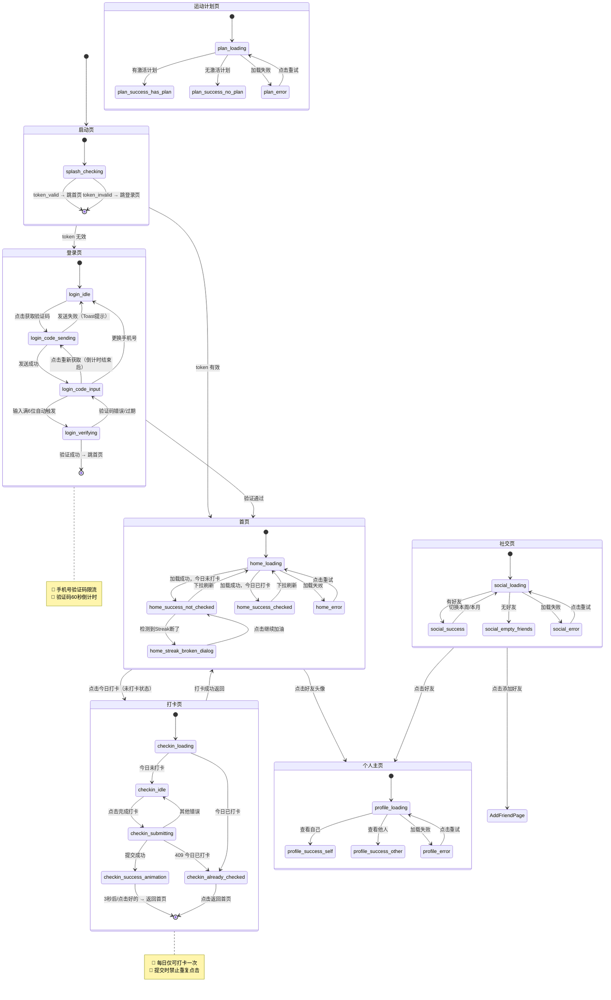

# FitStreak 可视化状态机

## Part A：Mermaid 状态流程图



---

## Part B：状态-线框图对照表

---

## 启动页（SplashPage）

### 状态：splash_checking（Token 检查中）
> 触发条件：App 启动

```
┌─────────────────────────────────┐
│                                 │
│                                 │
│         🔥 FitStreak            │
│                                 │
│      让每一次运动被看见          │
│                                 │
│           ⏳ 加载中...           │
│                                 │
└─────────────────────────────────┘
```

---

## 登录页（LoginPage）

### 状态：login_idle（输入手机号）
> 触发条件：Token 无效/首次启动

```
┌─────────────────────────────────┐
│         🔥 FitStreak            │
│      让每一次运动被看见          │
├─────────────────────────────────┤
│  手机号登录                      │
│  +86  [___________________]    │  🔴 仅允许输入数字
│  [      获取验证码      ]       │  🔴 格式正确才可点
│  登录即表示同意《用户协议》       │
└─────────────────────────────────┘
```

### 状态：login_code_input（输入验证码）
> 触发条件：验证码发送成功

```
┌─────────────────────────────────┐
│  验证码已发送至 138****8888      │  🔴 脱敏展示
│  [ _ ][ _ ][ _ ][ _ ][ _ ][ _ ]│  🔴 6位，自动聚焦
│  60秒后可重新获取                │  🔵 倒计时
│  [更换手机号]                   │
└─────────────────────────────────┘
```

### 状态：login_verifying（验证中）
> 触发条件：输入满6位自动触发

```
┌─────────────────────────────────┐
│  验证码已发送至 138****8888      │
│  [✓][✓][✓][✓][✓][✓]          │  🔵 输入框禁用
│  ⏳ 验证中...                   │  🔴 用户无法操作
└─────────────────────────────────┘
```

---

## 首页（HomePage）

### 状态：home_loading（加载中）
> 触发条件：页面挂载/Token验证通过

```
┌─────────────────────────────────┐
│  FitStreak         [🔔] [👤]   │
├─────────────────────────────────┤
│  ████████████████████████████  │  骨架屏（用户卡片）
│  ████████████████████████████  │  骨架屏（动态卡片×3）
└─────────────────────────────────┘
```

### 状态：home_success_not_checked（今日未打卡）
> 触发条件：加载成功且今日未打卡

```
┌─────────────────────────────────┐
│  FitStreak         [🔔] [👤]   │
├─────────────────────────────────┤
│ ┌─────────────────────────────┐ │
│ │  🔥 连续打卡 12 天           │ │
│ │  本周目标：3/5天             │ │
│ │  [  + 今日打卡  ]           │ │  🔴 橙色大按钮
│ └─────────────────────────────┘ │
│  好友动态...                     │
└─────────────────────────────────┘
```

### 状态：home_success_checked（今日已打卡）
> 触发条件：加载成功且今日已打卡

```
┌─────────────────────────────────┐
│  FitStreak         [🔔] [👤]   │
├─────────────────────────────────┤
│ ┌─────────────────────────────┐ │
│ │  ✅ 今日已打卡！             │ │  🟢 绿色状态
│ │  🔥 连续打卡 13 天  +1      │ │  🔴 Streak +1 动效
│ │  今日：跑步 30分钟           │ │
│ └─────────────────────────────┘ │
│  好友动态...                     │
└─────────────────────────────────┘
```

### 状态：home_streak_broken_dialog（Streak 断了弹窗）
> 触发条件：昨日未打卡，Streak归零

```
┌─────────────────────────────────┐
│   ╔═════════════════════════╗   │
│   ║   💔 Streak 断了...      ║   │  🔴 全屏遮罩弹窗
│   ║  昨天没有打卡，连续天数   ║   │
│   ║  已重置为 0              ║   │
│   ║  最高记录：23天           ║   │  🟢 展示历史鼓励
│   ║  [    继续加油 💪    ]   ║   │
│   ╚═════════════════════════╝   │
└─────────────────────────────────┘
```

### 状态：home_error（加载失败）
> 触发条件：接口返回错误

```
┌─────────────────────────────────┐
│  FitStreak         [🔔] [👤]   │
├─────────────────────────────────┤
│                                 │
│         ⚠️ 加载失败             │
│    网络连接不稳定，请重试        │
│    [      重试      ]          │  🔴 重试按钮
│                                 │
└─────────────────────────────────┘
```

---

## 打卡页（CheckInPage）

### 状态：checkin_idle（表单待输入）
> 触发条件：今日未打卡

```
┌─────────────────────────────────┐
│  [← 返回]    今日打卡            │
├─────────────────────────────────┤
│  运动类型（必填）                 │
│  [ 🏃跑步 ][ 💪健身 ][ 🏊游泳 ]   │  🔴 选中橙色高亮
│  [ 🚴骑行 ][ 🧘瑜伽 ][ 🏀篮球 ]   │
│  [ ⚽足球 ][ 🎯其他 ]            │
│  运动时长：30分钟（滑块）         │  🔴 必填
│  心情：😄 😊 😐 😅 😩           │  🟢 选填
│  备注（选填）[________________]  │
│  [        完成打卡 ✓        ]   │  🔴 必填项完成才激活
└─────────────────────────────────┘
```

### 状态：checkin_submitting（提交中）
> 触发条件：点击"完成打卡"

```
┌─────────────────────────────────┐
│  [← 返回]    今日打卡            │
├─────────────────────────────────┤
│  （表单内容展示，全部禁用）       │  🔵 表单禁用
│  [      ⏳ 提交打卡中...   ]    │  🔴 按钮 loading，禁止重复点击
└─────────────────────────────────┘
```

### 状态：checkin_success_animation（打卡成功）
> 触发条件：API 返回 200

```
┌─────────────────────────────────┐
│         🎉 🎊 🎉              │  烟花动画
│       打卡成功！                 │
│       🔥 13 天                  │  Streak 放大动效
│      [       好的 👍        ]   │  🔴 点击/3秒后返回首页
└─────────────────────────────────┘
```

### 状态：checkin_already_checked（今日已打卡）
> 触发条件：今日已有打卡 / API返回409

```
┌─────────────────────────────────┐
│  [← 返回]    今日打卡            │
├─────────────────────────────────┤
│         ✅ 今天已经打卡了！       │
│  跑步 🏃  30 分钟               │  今日记录摘要
│  [    返回首页    ]              │  🔴 主操作
│  [    撤销本次打卡    ]          │  🔴 危险操作，灰色
└─────────────────────────────────┘
```

---

## 社交/排行榜页（SocialPage）

### 状态：social_loading（加载中）
> 触发条件：切换到社交 Tab

```
┌─────────────────────────────────┐
│  排行榜          [+添加好友]    │
├─────────────────────────────────┤
│  ████████████████████████████  │  骨架屏
└─────────────────────────────────┘
```

### 状态：social_success（有好友）
> 触发条件：好友列表非空

```
┌─────────────────────────────────┐
│  排行榜          [+添加好友]    │
├─────────────────────────────────┤
│  [本周 ●] [本月]               │
│  🥇 王五  5天  🥈 张三  4天    │
│  🥉 李四  4天   4 赵六  3天    │
│ ▶▶ 我  陈七  3天（橙色高亮）   │  🔴 我的行高亮
│   6  周八  2天                  │
│                                 │
│  进行中挑战卡片                  │
│  [   + 发起新挑战   ]          │
└─────────────────────────────────┘
```

### 状态：social_empty_friends（无好友）
> 触发条件：好友列表为空

```
┌─────────────────────────────────┐
│  排行榜                         │
├─────────────────────────────────┤
│     （插画：两个小人奔跑）       │
│    还没有好友，快去邀请           │
│  [      添加好友      ]         │  🔴 引导操作
└─────────────────────────────────┘
```

---

## 个人主页（ProfilePage）

### 状态：profile_success_self（自己的主页）
> 触发条件：查看自己的主页

```
┌─────────────────────────────────┐
│              我的      [⚙️设置]  │
├─────────────────────────────────┤
│  [头像 80×80]  陈七  ⭐高级版   │
│  总打卡128天 | 🔥13天 | 最高23天│
│  [  编辑资料  ]                 │  🔵 仅本人可见
│  成就徽章墙（4×2网格）          │
│  体重趋势折线图（30天）          │
│  [+记录体重]                    │
└─────────────────────────────────┘
```

### 状态：profile_success_other（他人主页）
> 触发条件：查看他人主页

```
┌─────────────────────────────────┐
│  [← 返回]    张三的主页          │
├─────────────────────────────────┤
│  [头像 80×80]  张三             │
│  总打卡98天 | 🔥5天 | 最高18天  │
│  [+加好友]  [发起挑战]           │  🔵 社交操作
│  已获得的成就（仅展示已解锁）     │  🔴 不展示体重数据
└─────────────────────────────────┘
```

---

## 运动计划页（PlanPage）

### 状态：plan_success_has_plan（有激活计划）
> 触发条件：存在激活计划

```
┌─────────────────────────────────┐
│  我的计划          [修改计划]   │
├─────────────────────────────────┤
│  🎯 减脂塑形计划               │
│  （圆形进度环：4/5天，80%）      │
│  🔥 当前连续 13 天              │
│  本周：✓✓✓✓○○○               │
│  [     制定新计划     ]         │
└─────────────────────────────────┘
```

### 状态：plan_success_no_plan（无计划）
> 触发条件：无激活计划

```
┌─────────────────────────────────┐
│  我的计划                       │
├─────────────────────────────────┤
│     （插画：日历+运动小人）       │
│     还没有运动计划               │
│   [      制定运动计划      ]    │  🔴 橙色大按钮
│   推荐模板：减脂入门 / 增肌计划  │  🟢 快速选择模板
└─────────────────────────────────┘
```
