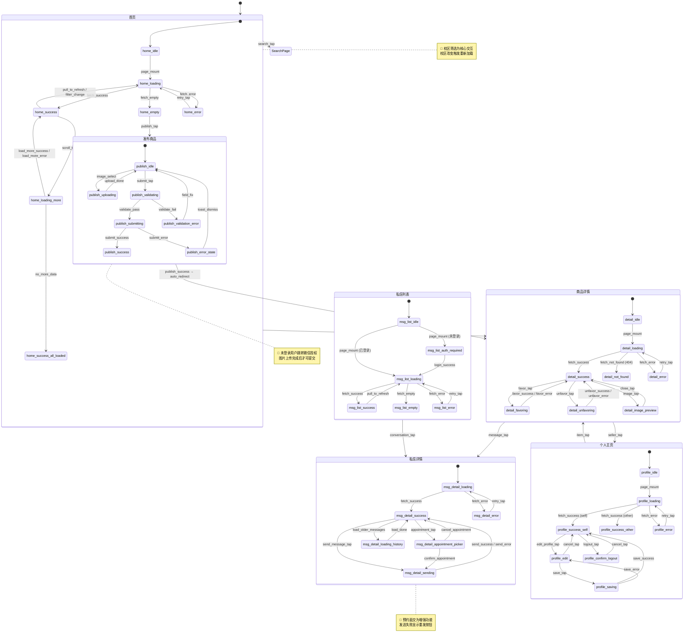

# 拾物 - 可视化状态机

## Part A：Mermaid 状态流程图



---

## Part B：状态-线框图对照表

---

## 首页（HomePage）

### 状态：home_loading（加载中）
> 触发条件：页面挂载 / 切换校区 / 切换分类

```
┌─────────────────────────────────┐
│  拾物          [🔍搜索] [📍校区] │  🔴 顶部导航固定
├─────────────────────────────────┤
│  [全部] [教材] [电子] [生活] [服装]│  分类标签骨架屏
├─────────────────────────────────┤
│  ┌────────┐  ┌────────┐         │
│  │░░░░░░░░│  │░░░░░░░░│         │  🔵 骨架屏卡片占位
│  │░ IMG ░░│  │░ IMG ░░│         │
│  └────────┘  └────────┘         │
│  ░░░░░░░░░░  ░░░░░░░░░░         │
│  ░░░░░░░     ░░░░░░              │
│                                 │
│  ┌────────┐  ┌────────┐         │
│  │░░░░░░░░│  │░░░░░░░░│         │
│  └────────┘  └────────┘         │
├─────────────────────────────────┤
│  [🏠首页] [💬消息] [➕发布] [👤我]│  🔴 底部Tab栏固定
└─────────────────────────────────┘
```

---

### 状态：home_success（列表正常展示）
> 触发条件：数据加载成功

```
┌─────────────────────────────────┐
│  拾物          [🔍搜索] [📍南校区]│  🔴 校区可点击切换
├─────────────────────────────────┤
│ [全部▼] [📚教材] [📱电子] [🏠生活]│  🔵 分类标签水平滚动
├─────────────────────────────────┤
│  ┌────────┐  ┌────────┐         │
│  │  IMG   │  │  IMG   │         │  🔵 瀑布流布局
│  └────────┘  └────────┘         │
│  高等数学(上)  iPhone 13         │  🔵 标题最多 2 行
│  ¥25         ¥2,800             │  🔴 价格必须显示
│  👤小明 南校区  👤小红 东校区    │
├─────────────────────────────────┤
│  [🏠首页] [💬消息] [➕发布] [👤我]│
└─────────────────────────────────┘
```

---

### 状态：home_empty（无商品）
> 触发条件：items.length === 0

```
┌─────────────────────────────────┐
│  拾物          [🔍搜索] [📍南校区]│
├─────────────────────────────────┤
│          🎒                     │
│    该校区暂无商品                │
│      [ 去发布闲置物 ]            │  🔴 引导按钮
├─────────────────────────────────┤
│  [🏠首页] [💬消息] [➕发布] [👤我]│
└─────────────────────────────────┘
```

---

### 状态：home_error（加载失败）
> 触发条件：API 错误或网络超时

```
┌─────────────────────────────────┐
│  拾物          [🔍搜索] [📍校区] │
├─────────────────────────────────┤
│          ⚠️                     │
│      加载失败，请检查网络         │
│        [ 重 试 ]                │  🔴 重试按钮
├─────────────────────────────────┤
│  [🏠首页] [💬消息] [➕发布] [👤我]│
└─────────────────────────────────┘
```

---

## 商品详情页（ItemDetailPage）

### 状态：detail_loading（加载中）
> 触发条件：点击商品卡片进入

```
┌─────────────────────────────────┐
│  [← 返回]    商品详情   [⋯更多]  │  🔴 顶部导航固定
├─────────────────────────────────┤
│  ░░░░░░░░░░░░░░░░░░░░░░░░░░░░░ │  图片骨架屏
│  ░░░░░░░░░░░░░░░░░░░░░░░░░░░░░ │
│  ░░░░░░░░  价格占位              │
│  ░░░░░░░░░░░░░░░  标题占位       │
│  ░░░░  ░░░░░░░░░░  卖家信息占位  │
├─────────────────────────────────┤
│  [❤ 收藏]       [ 💬 私信卖家 ] │
└─────────────────────────────────┘
```

---

### 状态：detail_success（正常展示）
> 触发条件：数据加载成功

```
┌─────────────────────────────────┐
│  [← 返回]    商品详情   [⋯更多]  │
├─────────────────────────────────┤
│  ┌─────────────────────────────┐│
│  │          IMG 1/3            ││  🔵 轮播图，点击全屏预览
│  └─────────────────────────────┘│
│              ● ○ ○              │
│  ¥25.00    ~~原价 ¥80~~         │  🔴 价格醒目
│  高等数学（上册）人教版 全新      │
│  📚 教材  📍 南校区  3小时前    │
│  九成新，只看了前三章...         │
│  [展开全部 ▼]                   │
│  ── 卖家 ──                    │
│  👤 小明同学  ★4.8  💚信用良好  │
├─────────────────────────────────┤
│  [❤ 收藏(23)]   [ 💬 私信卖家 ] │  🔴 底部操作栏，未登录不可用
└─────────────────────────────────┘
```

---

### 状态：detail_not_found（商品不存在）
> 触发条件：API 返回 404

```
┌─────────────────────────────────┐
│  [← 返回]    商品详情            │
├─────────────────────────────────┤
│           🗑️                    │
│      该商品已下架或不存在         │
│       [ 返回首页 ]               │  🔴 必须提供返回入口
└─────────────────────────────────┘
```

---

## 发布商品页（PublishItemPage）

### 状态：publish_idle（空白表单）
> 触发条件：页面初始加载

```
┌─────────────────────────────────┐
│  [✕ 取消]    发布闲置物          │  🔴 取消按钮必须有
├─────────────────────────────────┤
│  ┌────┐ ┌────┐ ┌────┐ ┌──────┐ │
│  │IMG │ │    │ │    │ │  +   │ │  🔴 至少1张，最多6张
│  └────┘ └────┘ └────┘ └──────┘ │
│  商品标题 * [___________________]│  🔴 必填
│  分类 *            [请选择 ▸]   │  🔴 必选
│  校区 *            [南校区 ▸]   │  🔴 必选
│  售价 *    ¥ [_________________]│  🔴 必填
│  原价（可选）¥ [_______________]│
│  描述 [_________________________]│
│                                 │
│       [ 发 布 商 品 ]            │  🔴 主操作按钮
└─────────────────────────────────┘
```

---

### 状态：publish_validation_error（校验失败）
> 触发条件：必填字段未填时点击发布

```
┌─────────────────────────────────┐
│  [✕ 取消]    发布闲置物          │
├─────────────────────────────────┤
│  ⚠️ 请完善以下信息后再发布        │  🔴 顶部错误总结
│  商品标题 * [___________________]│
│             ⚠️ 请输入商品标题    │  🔴 字段级错误提示（红色）
│  分类 *          [请选择分类 ▸]  │  🔴 边框变红
│       [ 发 布 商 品 ]            │
└─────────────────────────────────┘
```

---

### 状态：publish_submitting（提交中）
> 触发条件：校验通过后点击发布

```
┌─────────────────────────────────┐
│  [✕ 取消]    发布闲置物          │
├─────────────────────────────────┤
│  （表单全部禁用，变灰）            │  🔴 防止重复提交
│                                 │
│    [ ⏳ 发布中，请稍候... ]      │  🔴 按钮 loading，不可点击
└─────────────────────────────────┘
```

---

## 私信列表页（MessageListPage）

### 状态：msg_list_auth_required（未登录）
> 触发条件：用户未登录访问消息页

```
┌─────────────────────────────────┐
│            消息                 │
├─────────────────────────────────┤
│          💬                     │
│      登录后即可查看消息           │
│    [ 微信一键登录 ]               │  🔴 必须提供登录入口
├─────────────────────────────────┤
│  [🏠首页] [💬消息] [➕发布] [👤我]│
└─────────────────────────────────┘
```

---

### 状态：msg_list_success（有消息）
> 触发条件：conversations.length > 0

```
┌─────────────────────────────────┐
│            消息                 │
├─────────────────────────────────┤
│  👤  小红同学           3分钟前  │
│      关于：iPhone 13             │
│      好的，明天下午可以吗         │
│─────────────────────────────────│
│  👤  小王同学  ●2       昨天    │  🔴 未读红色角标
│      关于：高等数学教材           │
│      这本书还在吗？              │
├─────────────────────────────────┤
│  [🏠首页] [💬消息●3] [➕发布] [👤我]│  🔴 Tab总未读数
└─────────────────────────────────┘
```

---

## 私信详情页（MessageDetailPage）

### 状态：msg_detail_success（正常对话）
> 触发条件：消息加载成功

```
┌─────────────────────────────────┐
│  [← 返回]    小红同学            │
├─────────────────────────────────┤
│  [IMG]  iPhone 13  ¥2,800  在售 │  🔵 商品上下文卡片
├─────────────────────────────────┤
│  ─── 昨天 14:30 ───             │
│  ┌─────────────┐                │
│  │ 你好，还在吗│                 │  对方消息（靠左）
│  └─────────────┘                │
│           ┌──────────────────┐  │
│           │ 在的！可面交      │  │  自己消息（靠右，主色）
│           └──────────────────┘  │
│  ┌──────────────────────────┐   │
│  │ 📅 预约面交               │   │  🔵 面交卡片
│  │ 明天 14:00 图书馆门口     │   │
│  │ [确认] [拒绝]             │   │
│  └──────────────────────────┘   │
├─────────────────────────────────┤
│  [📅预约] [___________________] [发]│  🔴 底部输入栏
└─────────────────────────────────┘
```

---

## 个人主页（ProfilePage）

### 状态：profile_success_self（自己的主页）
> 触发条件：is_self === true

```
┌─────────────────────────────────┐
│  [← 返回]    我的主页   [⚙️]    │
├─────────────────────────────────┤
│  👤(72px)  [✏️ 编辑资料]         │  🔵 编辑按钮
│  小明同学  ✓ 已认证  💚 信用良好 │
│  XX大学 · 南校区                │
│  ┌────────┬────────┬────────────┐│
│  │12件在售│8件已售 │★4.8(15评) ││
│  └────────┴────────┴────────────┘│
│  [在售(12)] [已售(8)] [收藏] [评价]│
│  ─────────────────────────────  │
│  ┌────────┐  ┌────────┐         │
│  │  IMG   │  │  IMG   │         │  自己发布的商品
│  └────────┘  └────────┘         │
├─────────────────────────────────┤
│  [🏠首页] [💬消息] [➕发布] [👤我]│
└─────────────────────────────────┘
```

---

### 状态：profile_success_other（他人主页）
> 触发条件：is_self === false

```
┌─────────────────────────────────┐
│  [← 返回]    小红同学            │  🔴 无编辑/设置按钮
├─────────────────────────────────┤
│  👤(72px)                        │  🔴 不显示编辑
│  小红同学  💚 信用良好            │
│  XX大学 · 东校区                │
│  ┌────────┬────────┬────────────┐│
│  │5件在售 │20件已售│★4.9(8评)  ││
│  └────────┴────────┴────────────┘│
│  [在售(5)]  [收到评价(8)]        │  🔵 他人无收藏Tab
│  ─────────────────────────────  │
│  ┌────────┐  ┌────────┐         │
│  │  IMG   │  │  IMG   │         │
│  └────────┘  └────────┘         │
├─────────────────────────────────┤
│  [🏠首页] [💬消息] [➕发布] [👤我]│
└─────────────────────────────────┘
```

---

### 状态：profile_edit（编辑资料）
> 触发条件：点击编辑按钮

```
┌─────────────────────────────────┐
│  [✕ 取消]    编辑资料   [保存]   │  🔴 取消和保存按钮必须有
├─────────────────────────────────┤
│  👤(72px)  [点击更换头像]         │  🔵 头像可更换
│  昵称 [小明同学_______________]  │  🔴 最多 30 字
│  校区          [南校区 ▸]       │
│                                 │
│        [ 保 存 修 改 ]           │  🔴 主操作按钮
└─────────────────────────────────┘
```
