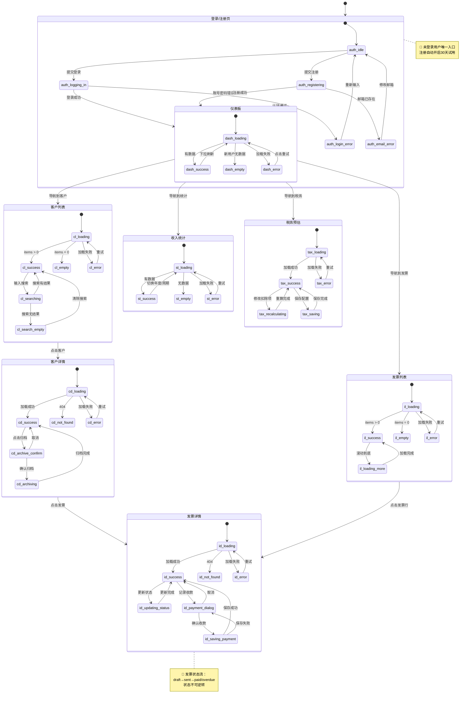

# FreelanceBook — 可视化状态机

## Part A：Mermaid 状态流程图



---

## Part B：状态-线框图对照表

---

## 登录/注册页（Auth）

### 状态：auth_idle（默认待输入）
> 触发条件：页面初始加载

```
┌─────────────────────────────────────────────┐
│          FreelanceBook                      │
│      自由职业者收入管理工具                  │
├─────────────────────────────────────────────┤
│   [  登录  ]      [  注册  ]                │
│   ─────────                                 │
│   邮箱                                      │
│   [________________________________]        │  🔴 必填
│   密码                                      │
│   [________________________________] [👁]   │  🔴 必填
│   [         登 录         ]                 │  🔴 主操作
│         忘记密码？                           │
└─────────────────────────────────────────────┘
```

---

### 状态：auth_logging_in（登录中）
> 触发条件：点击登录按钮

```
┌─────────────────────────────────────────────┐
│          FreelanceBook                      │
├─────────────────────────────────────────────┤
│   [  登录  ]      [  注册  ]                │
│   邮箱  [______________________]            │  🔵 输入框禁用
│   密码  [______________________] [👁]       │  🔵 输入框禁用
│   [      ⏳ 登录中...         ]             │  🔴 按钮禁止重复点击
└─────────────────────────────────────────────┘
```

---

### 状态：auth_login_error（账号密码错误）
> 触发条件：API 返回 401 且原因为凭证错误

```
┌─────────────────────────────────────────────┐
│          FreelanceBook                      │
├─────────────────────────────────────────────┤
│   [  登录  ]      [  注册  ]                │
│   ┌─────────────────────────────────────┐   │
│   │ ⚠️  邮箱或密码不正确，请重试          │   │  🔴 红色错误提示
│   └─────────────────────────────────────┘   │
│   邮箱  [______________________]            │  🔴 标红
│   密码  [______________________] [👁]       │  🔴 标红
│   [         重新登录         ]              │
└─────────────────────────────────────────────┘
```

---

## 仪表板（Dashboard）

### 状态：dash_loading（加载中）
> 触发条件：页面挂载

```
┌──────────────────────────────────────────────────────────────┐
│  FreelanceBook   [仪表板] [客户] [项目] [发票] [统计] [税务]  │
├──────────────────────────────────────────────────────────────┤
│  ┌────────┐  ┌────────┐  ┌────────┐  ┌────────┐              │
│  │ ░░░░░  │  │ ░░░░░  │  │ ░░░░░  │  │ ░░░░░  │              │  🔵 KPI 骨架屏
│  └────────┘  └────────┘  └────────┘  └────────┘              │
│  ┌───────────────────────────────────────────────────────┐   │
│  │  ░░░░░░░░░░░░░░░░░░░░░░░░░░░░░░░░░░░░░░░░░░░░░░░░░   │   │  🔵 图表骨架屏
│  └───────────────────────────────────────────────────────┘   │
└──────────────────────────────────────────────────────────────┘
```

---

### 状态：dash_success（正常展示）
> 触发条件：数据加载成功且存在收入记录

```
┌──────────────────────────────────────────────────────────────┐
│  FreelanceBook   [仪表板] [客户] [项目] [发票] [统计] [税务]  │
├──────────────────────────────────────────────────────────────┤
│  ┌────────────┐  ┌────────────┐  ┌────────────┐  ┌────────┐  │
│  │ 本月收入   │  │ 已收款发票 │  │  逾期发票  │  │ 待收款 │  │
│  │ ¥8,500     │  │   3 张     │  │ ⚠️ 1 张    │  │¥3,200 │  │  逾期用红色
│  └────────────┘  └────────────┘  └────────────┘  └────────┘  │
│  月度收入趋势                                                  │
│  ┌───────────────────────────────────────────────────────┐   │
│  │   ████  ████  ████  ████  ████  ████                  │   │
│  └───────────────────────────────────────────────────────┘   │
│  逾期发票提醒                                                  │
│  ┌───────────────────────────────────────────────────────┐   │
│  │  INV-008  · 腾讯科技 · ¥5,000 · 逾期 3 天             │   │  🔴 标红
│  └───────────────────────────────────────────────────────┘   │
└──────────────────────────────────────────────────────────────┘
```

---

### 状态：dash_empty（新用户无数据）
> 触发条件：用户刚注册，无任何发票或收入

```
┌──────────────────────────────────────────────────────────────┐
│  FreelanceBook   [仪表板] [客户] [项目] [发票] [统计] [税务]  │
├──────────────────────────────────────────────────────────────┤
│                  [  欢迎插画  ]                               │
│              欢迎使用 FreelanceBook！                         │
│          开始管理收入，先创建第一个客户                        │
│              [  + 创建第一个客户  ]                           │  🔴 主 CTA
└──────────────────────────────────────────────────────────────┘
```

---

## 发票详情（InvoiceDetail）

### 状态：id_loading（加载中）
> 触发条件：进入发票详情页

```
┌──────────────────────────────────────────────────────────────┐
│  [← 返回]                                                    │
├──────────────────────────────────────────────────────────────┤
│  ░░░░░░░░░░░░░░░░  (骨架)                                    │
│  ░░░░░░░  ·  ░░░░░░░░  ·  ░░░░░░                             │
│  ┌───────────────────────────────────────────────────────┐   │
│  │ ░░░░░░░░░░░░░░░░░░░░░░░░░░░░░░░░░░░░░░░░░░░░░░░░░░   │   │
│  └───────────────────────────────────────────────────────┘   │
└──────────────────────────────────────────────────────────────┘
```

---

### 状态：id_success / draft（草稿）
> 触发条件：发票 status === draft

```
┌──────────────────────────────────────────────────────────────┐
│  [← 返回]                                   [✏️ 编辑]        │  🔵 草稿才可编辑
│  INV-2026-008                              [草稿]            │
│  腾讯科技 · UI 设计改版项目                                   │
│  ¥5,000.00    开具 2026-03-01    到期 2026-03-31              │
│  [    标记为已发送    ]                                       │  🔴 状态流转按钮
└──────────────────────────────────────────────────────────────┘
```

---

### 状态：id_success / sent（已发送）
> 触发条件：发票 status === sent

```
┌──────────────────────────────────────────────────────────────┐
│  [← 返回]                                                    │
│  INV-2026-008                              [已发送]          │
│  腾讯科技 · UI 设计改版项目                                   │
│  ¥5,000.00    开具 2026-03-01    到期 2026-03-31              │
│  [  + 记录收款  ]          [  标记为逾期  ]                   │  🔴 两个操作按钮
└──────────────────────────────────────────────────────────────┘
```

---

### 状态：id_success / overdue（已逾期）
> 触发条件：发票 status === overdue

```
┌──────────────────────────────────────────────────────────────┐
│  [← 返回]                                                    │
│  INV-2026-008                              [已逾期]          │  🔴 红色标签
│  腾讯科技 · UI 设计改版项目                                   │
│  ¥5,000.00    开具 2026-02-01    到期 2026-03-01 ⚠️           │  🔴 到期日标红
│  ┌─────────────────────────────────────────────────────────┐ │
│  │  ⚠️ 此发票已逾期 21 天，请及时跟进                       │ │  🔴 逾期警告
│  └─────────────────────────────────────────────────────────┘ │
│  [          + 记录收款          ]                            │
└──────────────────────────────────────────────────────────────┘
```

---

### 状态：id_payment_dialog（记录收款弹窗）
> 触发条件：点击"记录收款"按钮

```
┌──────────────────────────────────────────────────────────────┐
│  （背景半透明）                                               │
│       ┌──────────────────────────────────────────┐           │
│       │  记录收款                          [✕]   │           │  🔴 弹窗
│       │  收款金额  [____________________]         │           │  🔴 必填
│       │  收款日期  [____________________]         │           │  🔴 必填，默认今天
│       │  收款方式  [银行转账 ▼]                   │           │  🔵 可选
│       │  备注      [____________________]         │           │  🟢 可选
│       │  [  取消  ]    [  确认收款  ]             │           │  🔴 主操作右侧
│       └──────────────────────────────────────────┘           │
└──────────────────────────────────────────────────────────────┘
```

---

## 收入统计（Stats）

### 状态：st_success（正常展示）
> 触发条件：统计数据加载成功

```
┌──────────────────────────────────────────────────────────────┐
│  FreelanceBook   [仪表板] [客户] [项目] [发票] [统计] [税务]  │
│  收入统计                     2026年 [< 上年] [下年 >]       │
│  ┌───────────┐  ┌───────────┐  ┌───────────┐  ┌──────────┐  │
│  │¥180,000   │  │¥162,000   │  │¥5,000     │  │  8 位    │  │  KPI
│  └───────────┘  └───────────┘  └───────────┘  └──────────┘  │
│  [月度] [季度]                                               │
│  ┌───────────────────────────────────────────────────────┐   │
│  │  柱状图...                                            │   │
│  └───────────────────────────────────────────────────────┘   │
│  ┌──────────────────┐  ┌──────────────────────────────────┐  │
│  │  饼图            │  │  腾讯科技 ¥62,000 34%            │  │
│  │                  │  │  字节跳动 ¥45,000 25%            │  │
│  └──────────────────┘  └──────────────────────────────────┘  │
└──────────────────────────────────────────────────────────────┘
```

---

## 税务预估（Tax）

### 状态：tax_success（正常展示）
> 触发条件：税务数据加载成功

```
┌──────────────────────────────────────────────────────────────┐
│  FreelanceBook   [仪表板] [客户] [项目] [发票] [统计] [税务]  │
│  税务预估                         2026年度 [▼]               │
│  ⚠️ 仅供参考，以税务局实际申报为准                            │  🔴 免责声明
│  ┌─────────────────────────────────────────────────────────┐ │
│  │  年度总收入                           ¥180,000.00       │ │
│  │  基本减除费用                         -¥60,000.00       │ │
│  │  专项附加扣除                         -¥36,000.00       │ │
│  │  应纳税所得额                          ¥84,000.00       │ │
│  │  预计应缴税                            ¥14,280.00  🔴   │ │  🔴 红色大字
│  │  综合税率                                     17.0%     │ │
│  └─────────────────────────────────────────────────────────┘ │
│  专项附加扣除配置                             [保存配置]     │
│  子女教育    [________] 元/年                               │
│  住房贷款    [________] 元/年                               │
│  住房租金    [________] 元/年                               │
│  赡养老人    [________] 元/年                               │
└──────────────────────────────────────────────────────────────┘
```

### 状态：tax_recalculating（扣除项更改重算中）
> 触发条件：用户修改任意扣除项输入框（防抖 500ms 后触发）
> UI 差异：结果卡片显示轻微 loading 遮罩，其余与 tax_success 相同
