# footX — 可视化状态机

## Part A：完整状态流程图（Mermaid）

```mermaid
stateDiagram-v2
  [*] --> LoginPage

  %% ════════ 认证流程 ════════
  state "登录页" as LoginPage {
    [*] --> login_idle
    login_idle --> loading_apple : 点击 Apple 登录
    login_idle --> loading_google : 点击 Google 登录
    login_idle --> email_form : 点击邮箱登录
    loading_apple --> login_success : OAuth 成功
    loading_apple --> login_error : OAuth 失败/取消
    loading_google --> login_success : OAuth 成功
    loading_google --> login_error : OAuth 失败/取消
    email_form --> loading_email : 点击 Log In
    loading_email --> login_success : 验证通过
    loading_email --> email_error : 账号/密码错误
    email_error --> email_form : 重试
    login_error --> login_idle : 重试
  }
  LoginPage --> OnboardingPage : 首次登录
  LoginPage --> HomePage : 老用户

  note right of LoginPage
    🔴 Apple Sign-In 必须排第一位（Apple 要求）
    🔴 未登录不可访问任何其他页面
  end note

  %% ════════ 引导流程 ════════
  state "引导页" as OnboardingPage {
    [*] --> step1_shoe_size
    step1_shoe_size --> step2_basic_info : Next
    step2_basic_info --> step3_sport : Next
    step2_basic_info --> step1_shoe_size : Back
    step3_sport --> saving : Finish
    step3_sport --> [*] : Skip
    saving --> [*] : 保存成功
    saving --> ob_error : 保存失败
    ob_error --> saving : 重试
  }
  OnboardingPage --> HomePage : 完成/跳过

  %% ════════ 首页 ════════
  state "首页" as HomePage {
    [*] --> home_loading
    home_loading --> home_success : 数据加载完成
    home_loading --> home_error : 加载失败
    home_success --> home_empty_new : 新用户无分析记录
    home_success --> home_error : 加载失败
  }
  HomePage --> AnalysisShoeTypePage : 点击新分析 / Start
  HomePage --> AnalysisReportPage : 点击最近报告
  HomePage --> ProductListPage : 点击 Shop
  HomePage --> OrderListPage : 点击 Orders

  %% ════════ 分析流程（核心） ════════
  state "分析流程" as AnalysisFlow {
    state "Step1: 鞋类选择" as ShoeType {
      [*] --> shoe_idle
      shoe_idle --> shoe_selected : 选择类型
      shoe_selected --> shoe_idle : 更换选择
    }
    state "Step2: 视频录制" as Recording {
      [*] --> rec_guide
      rec_guide --> rec_camera : 打开相机
      rec_camera --> rec_recording : 开始录制
      rec_camera --> rec_permission_err : 权限被拒
      rec_recording --> rec_reviewing : 停止/达到最长时长
      rec_reviewing --> rec_camera : 重拍
    }
    state "Step3: 上传+分析" as Uploading {
      [*] --> uploading
      uploading --> processing : 上传完成
      uploading --> upload_error : 上传失败
      processing --> analysis_done : 分析完成
      processing --> proc_error : 分析失败/超时
      upload_error --> uploading : 重试
      proc_error --> processing : 重试
    }

    ShoeType --> Recording : 确认鞋类
    Recording --> Uploading : 确认视频
  }
  AnalysisShoeTypePage --> AnalysisRecordingPage : 确认鞋类
  AnalysisRecordingPage --> AnalysisUploadingPage : 确认视频
  AnalysisUploadingPage --> AnalysisReportPage : 分析完成
  AnalysisUploadingPage --> HomePage : 放弃/失败返回

  %% ════════ 报告页 ════════
  state "分析报告" as AnalysisReportPage {
    [*] --> report_loading
    report_loading --> report_success : 加载完成
    report_loading --> report_error : 加载失败
    report_success --> report_sharing : 点击分享
    report_sharing --> report_success : 关闭分享
  }
  AnalysisReportPage --> ProductDetailPage : 点击推荐商品
  AnalysisReportPage --> ProductListPage : Shop All

  %% ════════ 商品 ════════
  state "商品列表" as ProductListPage {
    [*] --> prod_list_loading
    prod_list_loading --> prod_list_success : 加载完成
    prod_list_success --> prod_list_filter : 打开筛选
    prod_list_filter --> prod_list_success : 应用/关闭
    prod_list_success --> prod_list_empty : 无匹配
  }
  ProductListPage --> ProductDetailPage : 点击商品

  state "商品详情" as ProductDetailPage {
    [*] --> prod_detail_loading
    prod_detail_loading --> prod_detail_success : 加载完成
    prod_detail_success --> adding_cart : 点击 Add to Cart
    adding_cart --> prod_detail_success : 加购成功(Toast)
    adding_cart --> prod_cart_err : 加购失败
  }
  ProductDetailPage --> CartPage : 点击购物车图标

  %% ════════ 购买流程 ════════
  state "购物车" as CartPage {
    [*] --> cart_loading
    cart_loading --> cart_has_items : 有商品
    cart_loading --> cart_empty : 空车
    cart_has_items --> cart_empty : 删除最后一件
  }
  CartPage --> CheckoutPage : Proceed to Checkout

  state "结算页" as CheckoutPage {
    [*] --> checkout_idle
    checkout_idle --> addr_selector : 更改地址
    addr_selector --> checkout_idle : 选择/关闭
    checkout_idle --> payment_processing : 点击支付
    payment_processing --> payment_error : 支付失败
    payment_error --> checkout_idle : 重试
  }
  CheckoutPage --> OrderConfirmationPage : 支付成功
  CheckoutPage --> AddressManagementPage : 添加新地址

  state "订单确认" as OrderConfirmationPage {
    [*] --> order_success
  }
  OrderConfirmationPage --> OrderDetailPage : 查看订单详情
  OrderConfirmationPage --> HomePage : 继续购物

  state "订单列表" as OrderListPage {
    [*] --> ol_loading
    ol_loading --> ol_success : 有订单
    ol_loading --> ol_empty : 无订单
  }
  OrderListPage --> OrderDetailPage : 点击订单

  %% ════════ 地址管理 ════════
  state "地址管理" as AddressManagementPage {
    [*] --> addr_loading
    addr_loading --> addr_list : 加载完成
    addr_list --> addr_confirming_delete : 点击 Delete
    addr_confirming_delete --> addr_list : 确认删除/取消
  }
  AddressManagementPage --> AddressFormPage : 添加/编辑
  AddressFormPage --> AddressManagementPage : 保存成功/返回
```



---

## Part B：状态-线框图对照表

---

### 登录页（LoginPage）

#### 状态：login_idle（默认选项）
> 触发条件：App 冷启动，用户未登录

```
┌─────────────────────────────────┐
│         footX logo              │
│    "Find Your Perfect Fit"      │
├─────────────────────────────────┤
│  ┌───────────────────────────┐  │
│  │  🍎  Continue with Apple  │  │  🔴 iOS 必须排第一
│  └───────────────────────────┘  │
│  ┌───────────────────────────┐  │
│  │  G   Continue with Google │  │
│  └───────────────────────────┘  │
│  ──── or ────                   │
│  ┌───────────────────────────┐  │
│  │  Continue with Email      │  │
│  └───────────────────────────┘  │
│  Don't have an account? Sign up │
└─────────────────────────────────┘
```

#### 状态：loading_apple / loading_email（登录中）
> 触发条件：点击任意登录方式后

```
│  [所有按钮灰化/禁用]             │  🔴 防重复点击
│  ┌───────────────────────────┐  │
│  │     ⏳ Signing in...      │  │
│  └───────────────────────────┘  │
```

#### 状态：email_error（登录失败）
> 触发条件：邮箱/密码不匹配

```
│  ┌ ⚠️ Invalid email or password ┐│  🔴 错误提示块（红色）
│  Email [...] / Password [...]    │
│  [ Try Again ]                   │
```

---

### 分析流程 — Step 1（AnalysisShoeTypePage）

#### 状态：idle（选择鞋类）
> 触发条件：进入分析流程

```
│  Step 1 of 3  ████░░░░  33%     │
│  What type of shoes...          │
│  [ 🏃 Running ] [ 👔 Dress ]    │
│  [ 👟 Casual  ] [ 🏥 Medical ]  │
│  [ ⛰️ Hiking  ]                 │
```

#### 状态：selected（已选择）
> 触发条件：点击任意鞋类选项

```
│  [ ✓ 🏃 Running ] ← 高亮        │  🔴 选中高亮
│  [ Next: Record Video → ]       │  🔴 确认按钮出现
```

---

### 分析流程 — Step 2（AnalysisRecordingPage）

#### 状态：rec_guide（拍摄引导）
> 触发条件：确认鞋类后跳转

```
│  Step 2 of 3  ████████░░  66%   │
│  ① Stand barefoot on flat ground│
│  ② Walk naturally 10-15 steps   │
│  ③ Film from behind ankle height│
│  [ 📷 Open Camera ]             │
```

#### 状态：rec_recording（录制中）
> 触发条件：点击开始录制

```
│  [✕]      ⏺ REC  0:12          │  🔴 显示时长
│  [相机预览] Keep walking...      │  🟢 文字引导
│  ████████░░░░ 15s               │  🔵 进度条
│  [ ⏹ 停止录制 ]                  │
```

#### 状态：rec_reviewing（预览）
> 触发条件：停止录制

```
│  [← 重录]  Preview              │
│  [录制视频预览 + ▶ 播放]         │
│  Duration: 12 seconds           │
│  [ ✓ Use This Video ]           │  🔴 确认上传
│  [ 🔄 Retake ]                  │  🟢 重录
```

---

### 分析流程 — Step 3（AnalysisUploadingPage）

#### 状态：uploading（上传中）
> 触发条件：确认使用视频

```
│  [不显示返回按钮]                 │  🔴 防中断
│  [上传动画]                      │
│  ████████████░░░░  64%          │  🔵 实际上传进度
│  Please stay connected          │
```

#### 状态：processing（AI 分析中）
> 触发条件：视频上传完成

```
│  [足部扫描动效]                  │
│  ⠿ Detecting foot arch...  ✓   │
│  ⠿ Analyzing gait...       ⏳  │  🟢 分步骤进度（伪造感知）
│  ⠿ Building pressure map...    │
│  ⠿ Checking posture...          │
```

#### 状态：upload_error / proc_error（失败）
> 触发条件：网络断开 / AI 超时

```
│  [错误插图]                      │
│  Something went wrong           │
│  [ 🔄 Try Again ]               │  🔴 重试
│  Contact Support                │  🟢 联系支持
```

---

### 分析报告（AnalysisReportPage）

#### 状态：report_success（报告完整展示）
> 触发条件：AI 分析完成 / 从历史进入

```
│  Arch: Normal  Gait: Neutral    │
│  [环形体态评分: 78 GOOD]          │
│  ⚠️ Forward Head Posture         │  🔵 仅 forward_head=true 显示
│  [足底热力图]                     │
│  [推荐商品 × 2: 95% / 88% Match] │
│  [ Shop All Insoles → ]         │
```

---

### 购物车（CartPage）

#### 状态：cart_has_items
> 触发条件：有商品在购物车中

```
│  ProFit Standard  ×[−]1[+]  [🗑]│
│  ActiveFlex Plus  ×[−]1[+]  [🗑]│
│  Total: $64.98                  │
│  [ Proceed to Checkout → ]     │  🔴 主操作
```

#### 状态：cart_empty
> 触发条件：购物车为空 / 删除最后一件

```
│  [空购物车插图]                  │
│  Your cart is empty             │
│  [ Start Analysis First ]      │  🔴 引导主流程
│  [ Browse All Insoles ]        │
```

---

### 结算页（CheckoutPage）

#### 状态：checkout_idle
> 触发条件：点击 Proceed to Checkout

```
│  Delivery Address               │
│  [已选地址卡片]  [Change →]      │  🔴 必须有地址才能结算
│  Order Summary: Total $64.98    │
│  [ 🍎 Apple Pay ]               │  🔴 iOS 优先
│  [ 💳 Credit Card ]             │
│  [ Pay $64.98 ]                 │  🔴 主按钮
```

#### 状态：payment_processing（支付中）
> 触发条件：点击 Pay 按钮

```
│  [不显示返回按钮]                │  🔴 防止支付中断
│  Processing your payment...    │
│  Please do not close the app   │  🔴 强提示
│  [ ⏳ Processing... ]           │  🔴 按钮 loading
```

---

### 订单确认（OrderConfirmationPage）

#### 状态：order_success
> 触发条件：Stripe 支付成功

```
│  ✅ Order Placed!               │
│  Order #FX-20240001             │
│  Estimated: Mar 20-25, 2024     │
│  📧 Confirmation sent to email  │
│  [ View Order Details ]        │
│  [ Continue Shopping ]         │
```

---

### 地址管理（AddressManagementPage）

#### 状态：addr_list（有地址）
> 触发条件：进入地址管理页

```
│  [默认标签] Alex Johnson        │
│  123 Main St, NY 10001, US      │
│  [Edit]            [Delete]     │
│                                 │
│  Home · Jane Smith              │
│  456 Oak Ave, LA 90001, US      │
│  [Edit] [Set Default] [Delete]  │
│                                 │
│  [ + Add New Address ]          │
```

#### AddressFormPage — 状态：idle
> 触发条件：点击 Add / Edit

```
│  Full Name *                    │
│  Address Line 1 *               │
│  Address Line 2 (optional)      │
│  City *        State            │
│  ZIP Code *                     │
│  Country * ▼                   │  🔴 下拉选国家
│  Phone (optional)               │
│  ☑ Set as default               │
│  [ Save Address ]               │
```
