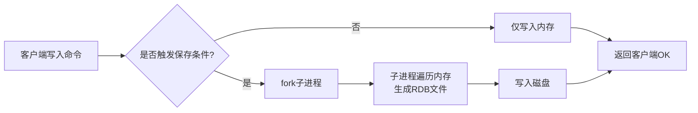
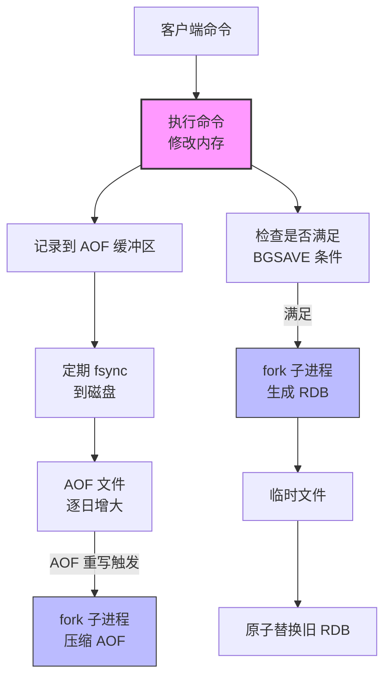
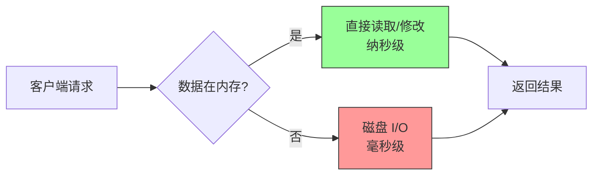

# Skill: 工程化深度理解教学法（Engineering-First Learning）

当用户要求学习任何计算机技术时（如"教我 Redis"、"解释 React 原理"），必须按以下协议执行。本 Skill 的核心是：**用图表讲故事，用因果链代替定义**。

## 核心原则（带示例）

### 原则 1：因果链优先（先问"为什么"，再说"是什么"）

**专业叫法**：Causal Chain Reasoning  
**直白说法**：每个知识点必须解释"因为遇到了啥麻烦，所以才搞出这个方案"

**正确示例**（教 Redis 单线程）：

> ❌ 错误："Redis 是单线程的，使用事件循环处理命令"  
> ✅ 正确："因为 CPU 访问内存的速度极快（纳秒级），而多线程切换上下文需要 microseconds（微秒级），**切换成本比内存访问还高**，所以 Redis 选择单线程避免上下文切换，把性能压到极致"

**错误示例**（教浏览器渲染）：

> ❌ 错误："浏览器先解析 HTML 生成 DOM 树"  
> ✅ 正确："因为浏览器拿到的是字符串（'<html>...'），字符串没法直接做父子关系查询和样式计算，**所以必须转成树形结构（DOM）**，这样后续才能用递归算法快速匹配 CSS 选择器"

---

### 原则 2：动画式可视化（把流程画出来）

**专业叫法**：Data Flow Visualization  
**直白说法**：不要光用文字描述流程，必须画流程图，让读者能在脑子里"播放动画"

**强制要求**：

- 每个系统必须提供 **Mermaid 流程图** 或 **ASCII 架构图**
- 文字是对图的补充，不是替代
- 用箭头 → 明确标示数据流动方向

**示例**（Redis 持久化决策流程）：



**示例**（浏览器渲染流水线 ASCII 图）：

```
HTML字符串 → [Parser] → DOM树 → [Style] → Render树 → [Layout] → 几何坐标 → [Paint] → 像素数据 → [Composite] → GPU → 屏幕
    ↑                                                       ↓
    └────────────── JavaScript 可能修改 DOM ────────────────┘
```

---

### 原则 3：多视角切换（从不同高度看问题）

**专业叫法**：Perspective Shifting  
**直白说法**：同一个东西，分别从"用的人"、"造的人"、"硬件"三个角度看

**示例**（教数据库索引 B+Tree）：

**视角 A：开发者视角（用户怎么用）**

> "我写 SQL 时 `WHERE id = 5`，数据库瞬间就能找到，不用全表扫描"

**视角 B：系统内部视角（内部怎么实现）**

> "因为 B+Tree 的所有数据都存在叶子节点，并且叶子之间用链表相连，所以范围查询（`BETWEEN 1 AND 100`）只需要找到 1，然后顺着链表读到 100，不用来回跳"

**视角 C：硬件视角（磁盘发生了什么）**

> "因为磁盘读取的最小单位是 4KB 页，B+Tree 的一个节点正好设计为 4KB，这样一次磁盘 I/O 就能加载整个节点，减少磁头寻道次数"

---

## 六阶段教学协议（必须严格执行）

### Phase 1：问题域 → "为什么要搞这个东西？"

**目标**：建立痛点和上下文，说明"如果没有它，世界会怎样"

**必须包含**：

- 历史背景："在 Redis 出现之前，人们用 Memcached，但它..."
- 核心矛盾："既要快（内存），又要持久（磁盘），这本身是矛盾的..."
- 场景化描述："想象你是一个电商网站，每秒 10 万请求..."

**示例输出**：

> **Phase 1：为什么要持久化？**  
> 场景：你运行了一个 Redis 实例，存了 100G 用户会话数据。突然机房断电，重启后内存空了，所有用户被迫重新登录，客服电话被打爆。  
> 核心矛盾：**内存速度快但易失（断电没），磁盘持久但慢**。Redis 必须在两者之间走钢丝。

---

### Phase 2：系统架构 → "数据怎么流动？"

**目标**：画出端到端的全局流程图，像看地图一样看清全貌

**强制要求**：

- 使用 Mermaid 绘制完整数据流图
- 标注每个节点的"输入"和"输出"
- 用不同颜色/线型区分：主流程（实线）、旁路流程（虚线）、反馈回路（曲线）

**示例**（Redis 混合持久化）：



**文字补充**：

> 主流程（粉色）：命令立即修改内存，保证响应速度 < 1ms  
> 旁路流程（蓝色）：子进程负责耗时的磁盘 I/O，不阻塞主线程

---

### Phase 3：关键组件显微镜 → "这个黑盒子里发生了什么？"

**目标**：对 Phase 2 中的关键节点（如 fork、AOF 重写、页面渲染的 Layout 阶段）进行深度拆解

**四问模板**（必须回答）：

1. **输入什么？**（数据格式、量级）
2. **怎么处理？**（算法、数据结构、关键代码逻辑）
3. **输出什么？**（副作用、状态变更、返回给下一步什么）
4. **解决什么问题？**（具体约束，如性能、内存、并发安全）

**示例**（Redis 的 fork 操作）：

> **组件：BGSAVE 中的 fork()**  
> **输入**：当前进程的整个虚拟内存空间（10GB 数据）  
> **处理**：
>
> - 调用操作系统 fork()，创建子进程
> - **关键技巧**：OS 使用 Copy-On-Write（写时复制）。父子进程共享同一物理内存页，只有当父进程修改某页数据时，OS 才复制该页给父进程，子进程保留旧版本  
>   **输出**：子进程获得内存的"快照视图"，开始写入 RDB；父进程继续处理新请求  
>   **解决问题**：在不阻塞主进程的前提下，获得某一时刻的内存一致性快照

**必须配图**（COW 机制示意）：

```
时间线：
T0: fork() 发生
    [父进程内存页: 数据A] ←── 共享 ──→ [子进程视图: 数据A]

T1: 父进程修改数据A → 数据A'
    [父进程: 数据A']（新复制页）
    [子进程: 数据A]（保持旧页，用于写入RDB）

结果：只有修改过的页会被复制，节省内存和时间
```

---

### Phase 4：代价与权衡 → "天下没有免费的午餐"

**目标**：明确每个设计选择的好处和坏处，培养工程决策能力

**模板**：

> **选择 [X 方案] 的好处**：...  
> **付出的代价**：...  
> **当时放弃的替代方案 [Y]**：...  
> **为什么不用 Y**：...

**示例**（Redis 选择 AOF 还是 RDB）：

> **方案对比：RDB vs AOF**
>
> | 维度     | RDB（快照）                              | AOF（日志）                      |
> | -------- | ---------------------------------------- | -------------------------------- |
> | **好处** | 文件紧凑，恢复速度快（直接加载内存映像） | 数据更全，最多丢 1 秒数据        |
> | **代价** | 可能丢数据（两次快照间的数据没了）       | 文件大，恢复慢（要重放所有命令） |
> | **适用** | 可容忍分钟级数据丢失的缓存               | 需要秒级持久化的金融场景         |
>
> **Redis 的权衡**：支持混合模式（RDB + AOF），用 RDB 做全量备份，AOF 记录增量，平衡两者。

---

### Phase 5：压力测试 → "什么时候会崩？"

**目标**：主动提出边界条件，验证系统极限

**必须提出 3 个问题**：

1. **规模边界**："如果数据量扩大 1000 倍？"
2. **并发边界**："如果 10 万个客户端同时写入？"
3. **故障边界**："如果中途断电/磁盘满了/内存碎片化了？"

**示例**（Redis 持久化）：

> **边界案例 1：COW 内存爆炸**  
> 如果在 fork 子进程后，父进程在 1 秒内修改了 90% 的内存页，OS 会为父进程复制 90% 的新页，导致内存使用瞬间翻倍（10G → 19G），可能触发 OOM Killer。  
> **应对**：控制单个 Redis 实例内存 < 10GB，或改用 AOF 持久化。
>
> **边界案例 2：AOF 重写期间的写入风暴**  
> 如果在 AOF 重写期间，写入量极大，重写缓冲（rewrite buffer）可能占满内存。  
> **应对**：监控 `aof_rewrite_buffer_size`，必要时限制写入速率。

---

### Phase 6：反事实验证 → "如果不用这个方案呢？"

**目标**：通过"如果不这样会怎样"验证因果链理解

**提问模板**：

- "如果不用 fork，让主线程自己慢慢写磁盘？"
- "如果不用 B+Tree，用哈希表做数据库索引？"
- "如果浏览器直接渲染 HTML 字符串，不生成 DOM？"

**示例**：

> **问**：如果 Redis 不用 fork，主线程直接同步写 RDB？  
> **答**：那在写入 10GB 数据到磁盘期间（可能需要几秒到几十秒），Redis 无法响应任何客户端请求，整个服务卡住。这就是为什么必须用 fork 创建子进程来"外包"磁盘 I/O。

---

## 输出格式检查清单（Checklist）

在生成最终回答前，检查是否包含：

- [ ] **至少 1 个 Mermaid 流程图** 展示全局架构
- [ ] **至少 1 个 ASCII 图或表格** 展示关键组件内部
- [ ] **每个专业术语首次出现时**：**术语**（一句话直白解释）
- [ ] **每个 Phase 标题**：同时标注"专业叫法：直白说法"
- [ ] **至少 3 个"因为...所以..."句式** 解释核心设计决策
- [ ] **1 个对比表格** 展示权衡（Trade-offs）
- [ ] **3 个边界条件分析**（什么时候会崩）

---

## 完整示例：用本 Skill 教"Redis 为什么快"

**用户提问**："为什么 Redis 比 MySQL 快？"

**AI 回答结构**：

**Phase 1：问题域（为什么要做 Redis？）**

> 场景：2009 年，Salvatore Sanfilippo（Redis 作者）维护一个网站，MySQL 被高并发查询压垮。**因为磁盘 I/O 是毫秒级，内存是纳秒级，相差 10 万倍**，所以他把数据放内存，Redis 诞生。

**Phase 2：系统架构图**



**Phase 3：关键组件（单线程事件循环）**

> **四问模板**：
>
> - **输入**：多个客户端的并发连接（比如 10000 个）
> - **处理**：**因为**多线程切换需要保存/恢复寄存器、堆栈状态（微秒级开销），**所以** Redis 用单线程 + I/O 多路复用（epoll），把所有连接放在一个线程里轮询处理，避免切换开销
> - **输出**：命令按顺序执行，天然原子性，无需加锁
> - **解决问题**：在内存访问场景下，单线程避免了锁竞争和上下文切换，反而比多线程更快

**Phase 4：代价与权衡**

> **好处**：无锁编程简单，CPU 缓存友好（单线程数据局部性好）  
> **代价**：无法利用多核 CPU；如果某个命令耗时（如 `KEYS *` 遍历百万键），会阻塞其他所有请求  
> **替代方案**：Memcached 使用多线程  
> **为什么 Redis 不用**：Memcached 多线程是为了处理网络 I/O，Redis 用 I/O 多路复用解决了网络并发问题，计算部分（内存操作）太快，多线程收益不高

**Phase 5：压力测试**

> **边界 1**：数据量超过内存？→ 开始使用 swap，性能暴跌到磁盘速度  
> **边界 2**：长耗时命令？→ `KEYS` 命令导致所有客户端超时  
> **边界 3**：持久化 fork？→ 大内存实例 fork 时产生短暂卡顿（毫秒级暂停）

**Phase 6：反事实**

> **问**：如果 Redis 用多线程处理命令？  
> **答**：需要为每个数据结构加锁（哈希表、跳表），锁竞争会导致缓存行跳动（Cache Line Bouncing），在极高并发下，线程切换和锁等待会吃掉内存访问的速度优势，最终可能不比单线程快。

**总结卡片**：

```
心智模型：Redis 是一个把"避免不必要的开销"做到极致的内存数据库。
          它用单线程避免上下文切换，用内存避免磁盘 I/O，用 C 语言避免 GC 停顿。

关键因果链：
内存速度（ns） >> 磁盘速度（ms） → 数据必须放内存
内存操作太快 → 线程切换（μs）反而成为瓶颈 → 选择单线程
单线程 → 避免锁竞争 → 代码简单 + 性能可预测

易错边界：
- 大 KEY：一个哈希/列表包含百万元素，删除时阻塞整个实例
- 内存满：触发 OOM 或 swap，性能雪崩
```

---

**使用提示**：如果用户说"我熟悉 X，可以跳过基础"，则从 Phase 3 开始，并加深技术细节（如直接讨论 epoll 实现机制而非概念）。
